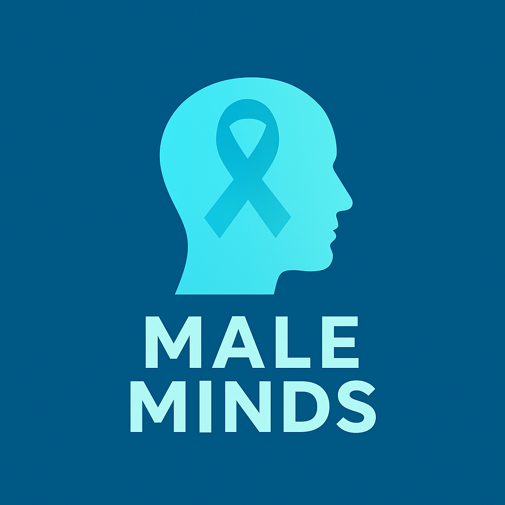

# Male Minds Suicide Awareness

## Project Overview
**Male Minds Suicide Awareness** is a website dedicated to supporting men’s mental health and raising awareness about suicide prevention. The platform provides resources, personal stories, and community support to ensure that no man feels alone in his struggles.

---

## Live Demo
Check out the live website here: [Live Site](https://hdlikethetv.github.io/my-first-project/)

---

## Features
- Responsive design using **Bootstrap 5**
- Hero section highlighting mental health awareness
- Embedded awareness video from YouTube
- Navigation bar with search functionality
- Footer with social media links and quick access resources
- Dedicated **Get Help** page with emergency contacts and support links

---

## User Stories (MVP)
- **Must Have:** Users can find immediate help via emergency contacts.  
As a visitor, I want to see a clear and compassionate introduction to the website’s purpose so that I immediately understand that this is a safe, supportive space focused on male mental health and suicide prevention.

🧩 Acceptance Criteria: Prominent hero section with a headline (e.g., “You’re Not Alone”), brief message, and a call-to-action button linking to resources.

- **Must Have:** As someone seeking help, I want to easily find links to trusted hotlines, therapy services, and mental health organizations so that I can get help quickly when I need it most.

🧩 Acceptance Criteria: Dedicated “Get Help” section or page with contact numbers, websites, and emergency information (e.g., Samaritans, Mind UK, NHS).

- **Must Have:** As a visitor, I want a fixed navigation bar with clear links to main pages (Home, Resources, Gallery, Sign Up) so that I can navigate the site easily.

🧩 Acceptance Criteria: Responsive Bootstrap navbar that collapses into a hamburger menu on smaller screens.

- **Must Have:** As a mobile user, I want the website to adapt to my screen size so that I can access the same information clearly on any device.

🧩 Acceptance Criteria: Bootstrap grid and responsive utilities used for all sections.

- **Must Have:** As a user with visual or cognitive impairments, I want the text to be readable and the contrast high so that I can access all information easily.

🧩 Acceptance Criteria: Use accessible color schemes, alt text for images, proper heading hierarchy, and ARIA roles if needed.

---
## AI Usage and Reflections 

- **Code Generation:** AI assisted in structuring HTML, CSS, and Bootstrap components, including responsive navbars, hero sections, and footers. This helped speed up development and ensure consistent design patterns.

- **Bug Resolution:** AI helped identify and suggest fixes for syntax and layout issues, such as button styling and responsive image scaling. Key interventions included adjusting CSS specificity and Bootstrap class usage.

- **Performance and UX:** AI contributed to improving page usability, accessibility, and visual hierarchy. Suggestions for responsive design, clear navigation, and semantic HTML enhanced user experience without adding manual overhead.

- **Workflow Efficiency:** Using AI reduced repetitive coding tasks and provided guidance on layout decisions, resulting in faster iterations and cleaner, maintainable code. Documentation focuses on outcomes rather than detailed prompts.
---
## Wireframes

